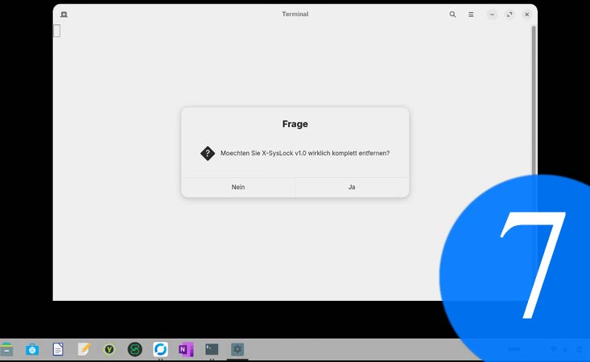
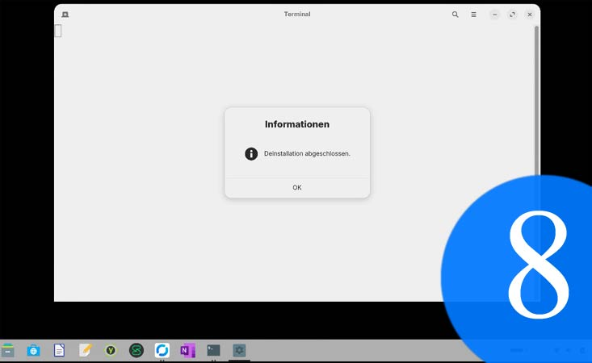

<p align="center">
  
</p>

X-SysLock ist ein Sicherheits-Tool fuer Zorin OS und Ubuntu-basierte Systeme, um eine Hardware-basierte Zwei-Faktor-Authentifizierung (2FA) fuer den System-Login und Sudo-Befehle in wenigen Schritten zu aktivieren. 

Dieses Tool wurde entwickelt, um den Login-Prozess physisch abzusichern – ideal fuer den Schutz von Familien-PCs (Parental Control) oder Arbeitsstationen.

## Features
- **Interaktive Installation**: Prueft Software und fuehrt den Nutzer Schritt fuer Schritt.
- **PIN-Transparenz**: Erklaert verstaendlich die Unterschiede zwischen FIDO2-, PIV- und Admin-PINs.
- **Sicherheit**: Erstellt automatische Backups (`.original.bak`) der PAM-Dateien.
- **GUI-Manager**: Einfaches Menue zum Aktivieren, Editieren oder Deinstallieren direkt aus dem Startmenue.

---

### ⚠️ WICHTIGER SICHERHEITSHINWEIS (Disclaimer)
Das Modifizieren von PAM (Pluggable Authentication Modules) kann bei Fehlkonfiguration dazu fuehren, dass Sie sich **komplett von Ihrem System aussperren**. 
- Stellen Sie sicher, dass Sie ein aktuelles Backup Ihrer Daten haben.
- Einen zweiten Rettungsanker Administrator/User-Account wird nicht funktionieren, solange ein YubiKey aktiviert ist (s. FAQ)!
- Die Nutzung von X-SysLock erfolgt auf eigene Gefahr.

---

## Quick Installation (One-Liner)

### Unterstuetzte Distributionen:
X-SysLock basiert auf dem `apt` Paketmanager und ist optimiert fuer:
- **Zorin OS** (Alle Versionen)
- **Ubuntu** (20.04 LTS, 22.04 LTS, 24.04 LTS und neuer)
- **Linux Mint** (Ab Version 20)
- **Debian** (Ab Version 11)
- **Pop!_OS**

Oeffnen Sie Ihr Terminal und geben Sie folgenden Befehl ein:

```bash <(wget -qO- https://raw.githubusercontent.com/albertuszerk/yubicosyslock/main/yubikey-master-setup.sh)```


## 📸 Screenshots & Preview
Hier sehen Sie X-SysLock im Einsatz:
<p align="center">
   
  
   
  
</p>

<p align="center">
   
  
   
  
</p>

---

## Understanding YubiKey PINs
Wenn X-SysLock waehrend der Registrierung nach einer PIN fragt, ist die **FIDO2-PIN** gemeint (s. Bild 6). Dies ist die PIN, die den Hardware-Login schuetzt.

### Die 3 Standard-PINs eines YubiKeys:
1. **FIDO2-PIN:** Wird fuer den System-Login genutzt (Standard: oft leer/nicht gesetzt).
2. **PIV-PIN:** Fuer Smartcards/Zertifikate (Standard: 123456).
3. **Admin-PIN:** Zur Hardware-Verwaltung (Standard: 12345678).

## FAQ
**Funktionieren mehrere Admin/User Accounts auf einem Linux System, solange ein YubiKey aktiviert ist?**
Nein. Mit einer Ausnahme - ist Auto-Logon aktiv, wird man automatisch in dieses Zweit-Profil als User(!) eingeloggt. Achtung - es gibt nur noch einen (YubiKey based) Admin Account auf dem System!

**Ich kann mich als Admin nicht einloggen, mein Passwort sei ungültig - ich bin sicher, mein Passwort richtig eingegeben zu haben!**
Ihr YubiKey steckt nicht im USB Slot oder kann vom NFC Leser nicht gelesen werden. Linux macht Sie nicht darauf aufmerksam, dass ein YubiKey fehlt. Schliessen Sie ihren YubiKey an.

**Funktioniert meine Admin/User Profile, sobald ich X-SysLock deinstalliert habe?**
Ja.

## Deinstallation
X-SysLock kann sauber ueber das eigene GUI-Menue entfernt werden. Es stellt die originalen PAM-Konfigurationen wieder her und loescht die Scripte sowie den Menue-Eintrag restlos.

## Lizenz
Creative Commons Attribution-NonCommercial-ShareAlike 4.0 International (CC BY-NC-SA 4.0)

## Tags
#xsyslock #yubikey #linuxsecurity #zorinos #cybersecurity #2fa #parentalcontrol #parental-control #childsafety #child-safety #familyprotection #family-protection #safelogin #safe-login #computeraccesscontrol #digitalparenting #digital-parenting #screentimesecurity #screen-time-management #homenetworksecurity #secureparenting #hardwaresecurity #linuxlogin #fido2 #zweifaktorauthentifizierung #hardwaretoken #sudosecurity #opensource #ubuntu #albertuszerk #yubicosyslock #access-control #kids-safety #cyber-safety #family-tech #protective-parenting #pc-lockdown #secure-access #internet-safety
