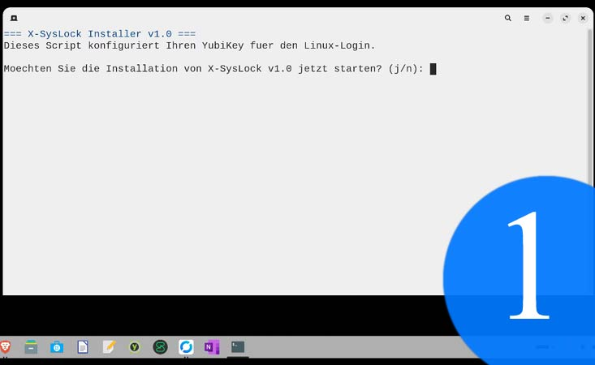
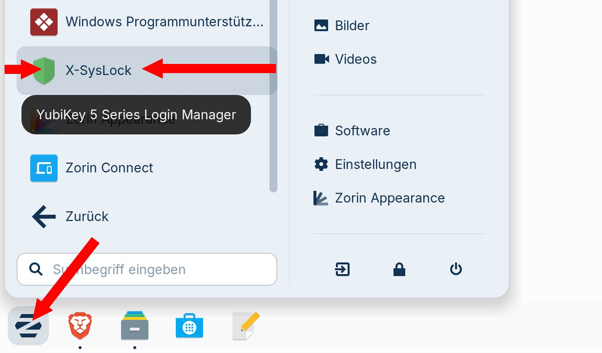
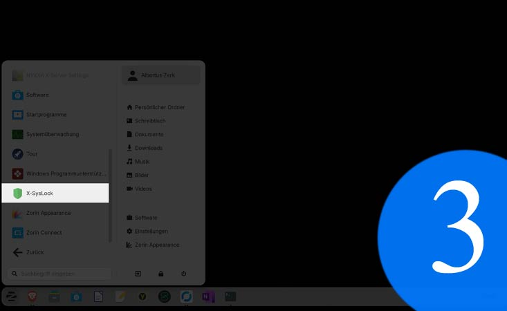
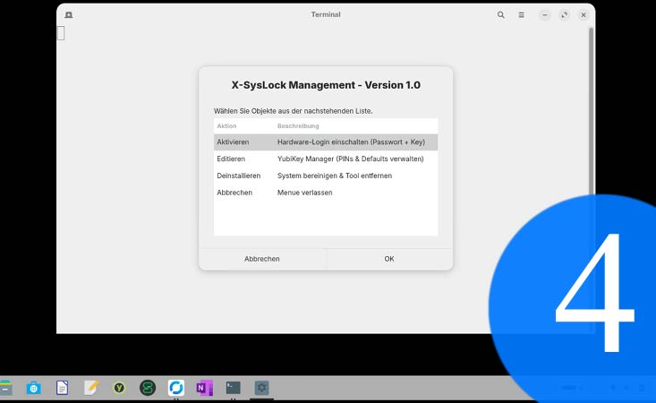
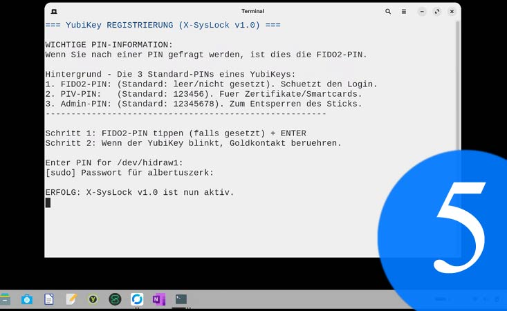
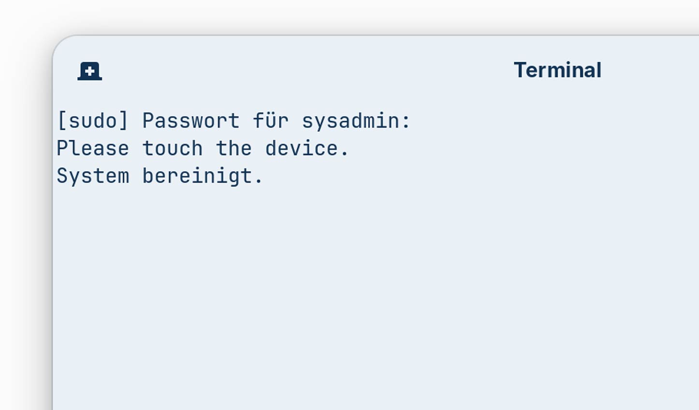

<p align="center">
  
</p>

# X-SysLock v1.1

X-SysLock ist ein Sicherheits-Tool fuer Zorin OS, Ubuntu und Debian-basierte Systeme, um eine Hardware-basierte Zwei-Faktor-Authentifizierung (2FA) fuer den System-Login und Sudo-Befehle in wenigen Schritten zu aktivieren. 

In der Version 1.1 liegt der Fokus auf maximaler Ausfallsicherheit durch die Unterstuetzung mehrerer YubiKeys (Multi-Key-Strategie), um ein Aussperren bei Verlust eines Schluessels zu verhindern. Ideal fuer den Schutz von Familien-PCs (Parental Control) oder Arbeitsstationen.

## Features (v1.1 Update)
- **Multi-Key-Strategie:** Registrieren Sie mehrere YubiKeys, um sich gegen den Verlust eines einzelnen Schluessels abzusichern.
- **Zenity-GUI Manager:** Ein benutzerfreundliches grafisches Menue zeigt den aktuellen Sicherheits-Status und die Anzahl der registrierten Keys an.
- **Schutz vor Aussperrung:** Das Tool erkennt, wenn nur ein Key vorhanden ist, und gibt eine deutliche Warnung aus.
- **Diebstahl-Modus:** Bei Verlust eines Keys koennen alle Zugaenge geloescht und mit einem verbleibenden Backup-Key neu aufgesetzt werden.
- **PIN-Transparenz:** Erklaert verstaendlich die Unterschiede zwischen FIDO2-, PIV- und Admin-PINs.
- **Sicherheit:** Erstellt automatische Backups (`.original.bak`) der PAM-Dateien bei der Installation.

---

### ⚠️ WICHTIGER SICHERHEITSHINWEIS (Disclaimer)
Das Modifizieren von PAM (Pluggable Authentication Modules) kann bei Fehlkonfiguration dazu fuehren, dass Sie sich **komplett von Ihrem System aussperren**. 
- Stellen Sie sicher, dass Sie ein aktuelles Backup Ihrer Daten haben.
- In v1.1 ist die Verwendung von mindestens **zwei YubiKeys** (Haupt- und Backup-Key) dringend empfohlen.
- Ein zweiter Rettungsanker Administrator/User-Account wird nicht funktionieren, solange ein YubiKey aktiviert ist (s. FAQ)!
- Die Nutzung von X-SysLock erfolgt auf eigene Gefahr.

---

## Quick Installation (v1.1)

### Unterstuetzte Distributionen:
X-SysLock basiert auf dem `apt` Paketmanager und ist optimiert fuer:
- **Zorin OS**, **Ubuntu** (20.04, 22.04, 24.04+), **Linux Mint**, **Debian** und **Pop!_OS**.

Oeffnen Sie Ihr Terminal und geben Sie folgenden Befehl ein:

```bash <(wget -qO- https://raw.githubusercontent.com/albertuszerk/yubicosyslock/main/yubikey-master-setup.sh)```

---

## 📸 Screenshots & Preview
Hier sehen Sie X-SysLock im Einsatz:
<p align="center">
   
   
  
</p>

<p align="center">
   
  
  
</p>

---

## YubiKey PINs verstehen
Wenn X-SysLock waehrend der Registrierung nach einer PIN fragt, ist die **FIDO2-PIN** gemeint (s. Bild 6). Dies ist die PIN, die den Hardware-Login schuetzt.

### Die 3 Standard-PINs eines YubiKeys:
1. **FIDO2-PIN:** Wird fuer den System-Login genutzt (Standard: oft leer/nicht gesetzt).
2. **PIV-PIN:** Fuer Smartcards/Zertifikate (Standard: 123456).
3. **Admin-PIN:** Zur Hardware-Verwaltung (Standard: 12345678).

## FAQ
**Was mache ich, wenn ein Schluessel gestohlen wurde?**
Kurzform: Loggen Sie sich mit Ihrem Backup-Key ein, oeffnen Sie den X-SysLock Manager und waehlen Sie "Kompletter Reset". Dadurch werden alle alten Keys (inklusive des gestohlenen) geloescht. Registrieren Sie danach Ihre vorhandenen Keys neu.

Schritt für Schritt erklaert (ausfuehrlich):
1. **Backup-Login:** Logge dich mit deinem Zweitschluessel ein.
2. **Terminal-Absicherung:** Oeffne ein Terminal und tippe `sudo -v`. Solange dieses Terminal offen ist, behaeltst du meist fuer 15 Minuten Root-Rechte, selbst wenn du die Keys gerade bearbeitest.
3. **Reset via Skript:** Starte das X-SysLock Menue und waehle Punkt 2 (Loeschen & Neu registrieren).
4. **Der entscheidende Test:** Bevor du dich ausloggst, oeffne ein neues Terminal und tippe `sudo ls`. Wenn die Abfrage nach dem neuen Key kommt und funktioniert, bist du sicher.

**Funktionieren mehrere Admin/User Accounts auf einem Linux System, solange ein YubiKey aktiviert ist?**
Nein. Mit einer Ausnahme - ist Auto-Logon aktiv, wird man automatisch in dieses Zweit-Profil als User(!) eingeloggt. Achtung - es gibt nur noch einen (YubiKey based) Admin Account auf dem System!

**Ich kann mich als Admin nicht einloggen, mein Passwort sei ungueltig - ich bin sicher, mein Passwort richtig eingegeben zu haben!**
Ihr YubiKey steckt nicht im USB Slot oder kann vom NFC Leser nicht gelesen werden. Linux macht Sie nicht darauf aufmerksam, dass ein YubiKey fehlt. Schliessen Sie ihren YubiKey an.

**Funktioniert meine Admin/User Profile, sobald ich X-SysLock deinstalliert habe?**
Ja.

## Deinstallation
X-SysLock kann sauber ueber das eigene GUI-Menue entfernt werden. Es stellt die originalen PAM-Konfigurationen wieder her und loescht die Scripte sowie den Menue-Eintrag restlos.

## Lizenz & Tags
Creative Commons Attribution-NonCommercial-ShareAlike 4.0 International (CC BY-NC-SA 4.0)

## Tags
#xsyslock #yubikey #linuxsecurity #zorinos #cybersecurity #2fa #parentalcontrol #parentalcontrol #childsafety #child-safety #familyprotection #family-protection #safelogin #safelogin #computeraccesscontrol #digitalparenting #digitalparenting #screentimesecurity #screen-time-management #homenetworksecurity #secureparenting #hardwaresecurity #linuxlogin #fido2 #zweifaktorauthentifizierung #hardwaretoken #sudosecurity #opensource #ubuntu #albertuszerk #yubicosyslock #accesscontrol #kidssafety #cybersafety #familytech #protectiveparenting #pclockdown #secureaccess #internetsafety
